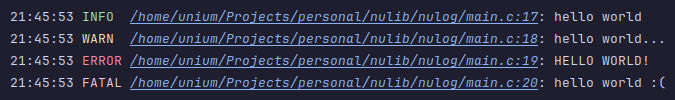

# NuLog

single header logging lib



## how to use

its very hard... you need to copy `nulog.h` into your project and include it:

```c
#include "nulog.h"
```

and using it is also just as hard...

```c
#include "nulog.h"

int main() {
    nulog_init(); // default settings

    DEBUG("hello, world?");
    INFO("hello world");
    WARN("hello world...");
    ERROR("HELLO WORLD!");
    FATAL("hello world :(");

    return 0;
}
```

## log levels
- `DEBUG`, `INFO`, `WARN`, `ERROR`, `FATAL`

## config

you can configure nulog's behaviour

```c
FILE* log_file = fopen("/path/to/log.txt", "w");
NuLogConfig config = {
    .min_level = NULOG_LEVEL_INFO,     // min. log level to display
    .show_timestamp = 1,               // should timestamps be shown in output
    .show_source = 1,                  // should source file and line be shown in output
    .colored_output = 1,               // should the output have colors*
    .output_stream = log_file          // output stream
};
nulog_configure(config);

fclose(log_file);
```
\* this is automatically disabled if the output location is a file

**inspired by [rxi/log.c](https://github.com/rxi/log.c/tree/master) i guess**